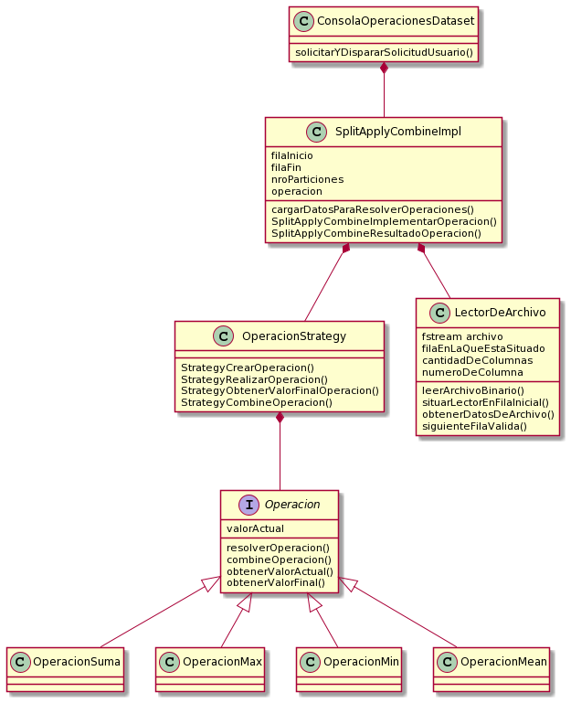
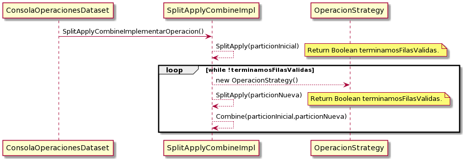
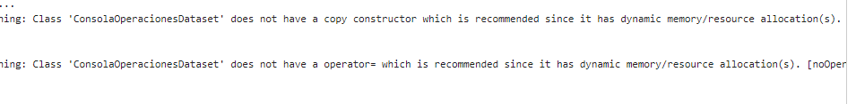

 # TRABAJO PRACTICO - SplitApplyCombine
 
Alumno: Jesus Andres Correa Tornero

Padrón: 102310

Link : https://github.com/andy0013/TP2.git

# Introducción

  El trabajo practico en esta ocasion responde a solicitudes del usuario, estas solicitudes son basicamente operaciones matematicas sobre un
  dataset, el cual no nos es posible cargarlo en memoria, por esta razon es que vamos a ir cargando los datos de a particiones y resolviendo
  operaciones sobre las mismas.
  
# MODELO
 
 El modelado del TP fue la etapa mas complicada que se presento. Como se comento previamente, la ejecucion del problema depende de la solicitud
 del usuario, lo que indica, que debemos de leer esa informacion, y luego disparar la ejecucion. Sin embargo, por cuestiones de modelado, seria
 bastante intuitivo, entonces, leer solicitud, disparar ejecucion. Sin embargo, fue algo que genero bastante molestia, ya que, no es nada comodo
 tener un solo metodo, en el cual se realicen estas dos tareas, realmente seria mas comodo tenerlas de manera independiente.
 
 **Pregunta: considerando el dominio del problema mencionado, y ademas, sabiendo que cada analisis que se solicite sera distinto, pero no es probable
 que se soliciten mas de 100 peticiones, seria posible cargar en una cola TODAS las peticiones, y luego ejecutarlas una a una, logicamente
 con el orden de una cola?**
 
 De momento, para resolver el modelo, sin tomar la decision de utilizar una cola, el modelo actual es el presentado:
 
 
 
 
## MODELO APLICADO
 
 Una breve explicacion de la forma en la que se esta realizando en este momento el procesamiento de datos, la siguiente:
 
 
 
 
 Como se puede observar, en el loop que estamos utilizando, creamos dos particiones distintas, antes de seguir con la particion siguiente
 hacemos el combine, por lo tanto, tenemos la informacion resultante del combine, y no las distintas particiones.
 
 
 **Pregunta: Al agregar hilos, en mi caso actual leo una Particion a la vez, deberia leer N particiones dependiendo de cantidad de hilos
 y luego dispararlos en simultaneo, una vez terminaron el procesamiento repetir continuamente. Pero, puedo reutilizar mi estrucutra
 actual de ir combinando por lectura los datos?, o deberia hacer como se sugiere en el enunciado que el Hilo principal detecte
 que se finalizo de leer particiones y hacer el combine de todo junto?**
 
 
 # PROBLEMAS ENTREGA 12/10
 
 ## SERCOM
 
  Se realizaron varias entregas, por una razon que aun desconozco, no me es posible ejecutar el CPP desde mi local con el Bash, tiene que ver con una cuestion de 
  python que desconozco como destrabar. Por esta razon, varias de las entregas se repitieron para ir eliminando estos errores de espacios, lineas mayores a 80
  caracteres, etc.
  
  Sin embargo, quedo pendiente por solucionar un mensaje que no me fue sencillo interpretar:
 
 
 
 
 ## DESARROLLO
 
  De momento se realizo la logica correspondiente al flujo sin utilizar hilos para cada particion, se espera que la estructura propuesta sea util para luego complementar con la nueva herramienta por aprender (hilos).
  Por parte de este desarrollo de logica sin hilos, aun quedo pendiente solucionar que el "getline" no identifica el #EOF. Para esta prueba intentamos desde consola (utilizamos Eclipse) (Ctrl + Z) o (Ctrl + D), pero no se enviaba el #EOF. Tambien se realizo la prueba levantando los input desde el archivo __stdin__ provisto por la catedra (con una configuracion del Eclipse), Y aun asi no lo reconoce. Para esto se uso tambien en codigo el "feof(stdin)". 
 Recapitulando:
 
  * Falta incorporar Hilos.
  * Detectar EOF.
  * Refactor.
  
  
