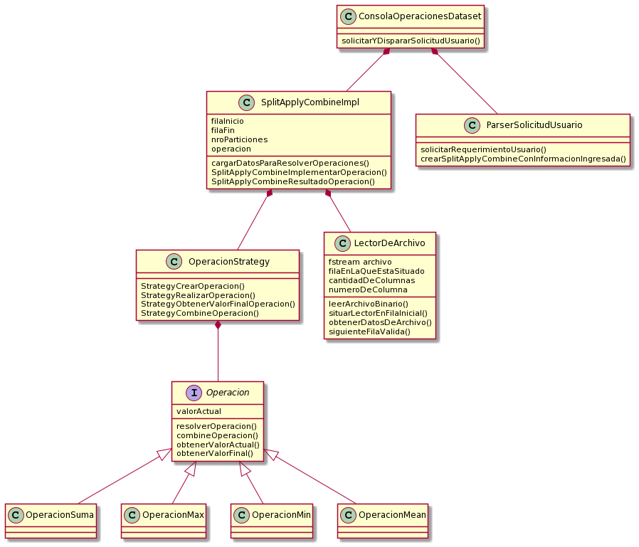

 # TRABAJO PRACTICO - SplitApplyCombine
 
Alumno: Jesus Andres Correa Tornero

Padrón: 102310

Link : https://github.com/andy0013/TP2.git

# Introducción

  El trabajo practico en esta ocasion responde a solicitudes del usuario, estas solicitudes son basicamente operaciones matematicas sobre un
  dataset, el cual no nos es posible cargarlo en memoria, por esta razon es que vamos a ir cargando los datos de a particiones y resolviendo
  operaciones sobre las mismas.
  
# MODELO
 
 El modelado del TP fue la etapa mas complicada que se presento. Como se comento previamente, la ejecucion del problema depende de la solicitud
 del usuario, lo que indica, que debemos de leer esa informacion, y luego disparar la ejecucion. Sin embargo, por cuestiones de modelado, seria
 bastante intuitivo, entonces, leer solicitud, disparar ejecucion. Sin embargo, fue algo que genero bastante molestia, ya que, no es nada comodo
 tener un solo metodo, en el cual se realicen estas dos tareas, realmente seria mas comodo tenerlas de manera independiente.
 
 **Pregunta: considerando el dominio del problema mencionado, y ademas, sabiendo que cada analisis que se solicite sera distinto, pero no es probable
 que se soliciten mas de 100 peticiones, seria posible cargar en una cola TODAS las peticiones, y luego ejecutarlas una a una, logicamente
 con el orden de una cola?**
 
 De momento, para resolver el modelo, sin tomar la decision de utilizar una cola, el modelo actual es el presentado:
 
 
 
 
## MODELO APLICADO
 
 Una breve explicacion de la forma en la que se esta realizando en este momento el procesamiento de datos, la siguiente:
 
 
 
 
 Como se puede observar, en el loop que estamos utilizando, creamos dos particiones distintas, antes de seguir con la particion siguiente
 hacemos el combine, por lo tanto, tenemos la informacion resultante del combine, y no las distintas particiones.
 
 
 **Pregunta:** En mi caso actual leo una Particion a la vez, cuando se agrege Hilos deberia leer N particiones dependiendo de cantidad de hilos
 a usar, luego dispararlos en simultaneo, y una vez terminaron el procesamiento repetir continuamente. **Pero, puedo reutilizar mi estrucutra
 actual de ir combinando por lectura los datos?, o deberia hacer como se sugiere en el enunciado que el Hilo principal detecte
 que se finalizo de leer particiones y hacer el combine de todo junto?**
 
 
 # PROBLEMAS ENTREGA 12/10
 
 ## SERCOM
 
  Se realizaron varias entregas, por una razon que aun desconozco, no me es posible ejecutar el CPP desde mi local con el Bash, tiene que ver con una cuestion de 
  python que desconozco como destrabar. Por esta razon, varias de las entregas se repitieron para ir eliminando estos errores de espacios, lineas mayores a 80
  caracteres, etc.
  
  Sin embargo, quedo pendiente por solucionar un mensaje que no me fue sencillo interpretar:
 
 
 
 
 ## DESARROLLO
 
  De momento se realizo la logica correspondiente al flujo sin utilizar hilos para cada particion, se espera que la estructura propuesta sea util para luego complementar con la nueva herramienta por aprender (hilos).
  Por parte de este desarrollo de logica sin hilos, aun quedo pendiente solucionar que el "getline" no identifica el #EOF. Para esta prueba intentamos desde consola (utilizamos Eclipse) (Ctrl + Z) o (Ctrl + D), pero no se enviaba el #EOF. Tambien se realizo la prueba levantando los input desde el archivo __stdin__ provisto por la catedra (con una configuracion del Eclipse), Y aun asi no lo reconoce. Para esto se uso tambien en codigo el "feof(stdin)". 
 Recapitulando:
 
  * Falta incorporar Hilos.
  * Detectar EOF.
  * Refactor.
  
  
# REENTREGA

# MODELO

 Como era de esperarse, posterior a agregar hilos, y siguiendo con las sugerencias hechas en los ISSUES, se hizo varios cambios en el modelo propuesto, es importante aclarar que en el esqueleto que sera presentado no estan todas las clases que interactuan en el flujo completo, ya que en caso de hacer un diagrama con todas las interacciones seria confuso.
 
 
 
 
 
 
 Como se puede observar en el nuevo modelo, ahora las operaciones forman parte del monitor *OperacionMonitor()*, el mismo, tiene la responsabilidad de la seguridad de las modificaciones, ya que sera una clase que contenga el valor final de las operaciones, y, ya que contiene el valor donde se realizan los cambios de los distintos hilos, debe ser protegido.
 
 Como se expreso previamente, este Monitor se envia en la clase *Particion* a la clase *ProtectedQueue*, que es una cola compartida, en donde se establecio el limite del tamaño de la misma, sujeta a la cantidad de Hilos. Aqui es donde se hacen los Push - Pop con ayuda de __condition_variables__; dependiendo si esta llena o vacia. Las Particiones seran pusheadas "una tras otra" en el hilo main, sin embargo, internamente, tendremos hilos que tomaran estos valores a traves de los threads activos, los podemos reconocer en el diagrama como *EjecutorTares*.

# DIAGRAMA SECUENCIA

 
 
De forma simplificada se muestra la ejecucion principal, en donde el usuario envia su input, y nosotros cargamos la Queue, adicional al grafico, se hace mencion que en este Loop se hace uso de las clases *ParserSolicitudUsuario*; la cual se encarga de decodificar el input y obtener los valores numericos recibidos y la clase *MensajeroDeParticiones*, la cual se encarga de enviar las particiones, es quien sabe que datos deben ser enviados; por ejemplo: la cantidad de particiones por solicutud.
 
# DESARROLLO

Luego de la finalizacion del tp, vamos a relatar cuales fueron principalmente los mayores problemas durante el mismo.

## INPUT

Como entorno de trabajo se utilizo __eclipse__, este entorno tiene un Bug hasta el dia de hoy sin solucion, que es el hecho de que no detecta el #EOF, aun cuando estamos utilizando una sentencia que debe detectarlo. Este bug que se me daba en local al realizar pruebas hizo que tenga que usar un for para recibir el stdin, ya que si lo hacia mediante un while, en algun punto se quedaba bloqueado esperando la entrada de input. Como consecuencia de esta lectura me vi en la obligacion de usar numeros hardcodeados en algunas sentencias en las que no deberia. Sin embargo, hasta el momento de pushear el codigo al sercom, ya que tenia todo hardcodead no me resulto problematico, sin embargo, en el momento de enviarlo el Sercom me marco un Segmentation Fault, y, este error que me llevo varias horas de debbuging fue un resultante del hardcode, ya que en el "multiops" se envian 4 operaciones, y tenia como consecuencia del error inicial harcodeado que se revise 5 operaciones.

## DATA RACE

Si bien tenia implementado el monitor desde un principio, estaba haciendo un lock(m) solo en el momento en el cual se hacia la operacion de split-apply-combine.
El problema fue que mientras se estaban realizando esas operaciones, el hilo main, avanza pusheando particiones, y en un momento actualizaba la informacion del Monitor, para
continuar con la siguiente operacion solicitada por el user. Para esto tuvimos que hacer un lock(m) en el update de estos datos, de otra forma, estaria interfiriendo con los hilos que estan funcionando en paralelo.

## HILOS

Sin embargo, creo que el verdadero desafio fue entender el funcionamiento y la interaccion de los Hilos que son lanzados para obtener los datos de la Queue y ejecutar la tarea, y el hilo main, entender como es que estos funcionan y la importancia del mutex. 

En varias ocasiones durante el desarrollo me quede pensando: 
¿Como puedo garantizar 'x' cosa, si no se si los hilos terminaron de sacar las particiones de la cola?
¿Como puedo enviar el token de fin de ejecucion, y si terminan mis hilos en simultaneo y no terminan de leer todas las particiones de la cola?

Cuestiones que en este momento me parecen completamente logicas y entendibles, en ese momento se me plantearon como un gran dilema, para el cual me toco ejecutar una y otra vez en modo debbug, agregar endpoints, y revisar el codigo - modificaciones agregadas.

# CORRECCION DE ISSUES

En esta seccion se explicara algunos de los Issues en los cuales nos encontramos con errores o cosas mas complicadas, o se requiere documentar algo en particular.
En referencia a los Issues no mencionados dejo explicito que fueron absolutamente todos revisados y corregidos. 

## LEAKS DE MEMORIA
Arrancando por los mas "sencillos" o automaticos, comenzamos por los Leaks de memoria, en muchos casos, se realizaron reservas de memoria en el heap injustificadamente, se redujeron todas las solicitudes de memoria salvo en los siguientes casos:

*- *OperacionMonitor*, esta clase almacena la informacion compartida a la que acceden todos los hilos, esta informacion que debe ser modificable desde distintos hilos se almacena en el Heap, ya que los distintos hilos comparten esta seccion.

--  *OperacionStrategy* asi mismo esta clase que forma parte de la anterior mencionada, y aplica polimorfismo, por esto se reserva memoria en el Heap.
-- *GestorHilos* Esta clase tiene un contenedor de objetos que no pueden ser copiados/movidos que son los threads, por esta razon se reservo memoria en el Heap.

## COPIAS DE STRING
En muchas situaciones me paso de estar enviando parametros por copia innecesariamente, en TODOS esos casos se corrigio para enviar referencias o moverlos segun sea necesario, sin embargo hay algunos casos en los que necesitaba que sean copias, voy a nombrar un ejemplo:

-- *MensajeroDeParticiones* Esta clase conociendo el nro de filas por particiones y fila inicio/fin, divide y calcula las particiones por enviar, ya que hay datos que son enviados en las Particiones, pero luego se siguen modificando y reutilizando, no podia moverlos, ya que los sigo usando, pero tampoco podia enviar las referencias, ya que nuevamente, seguiran modificandose. 

## COPIAS DE CLASES

Luego de dejar el codigo 100% funcionando, se procedio a hacer un refactor, corriguiendo las copias innecesarias, esta cuestion no solo envolvia a nuestros datos primitivos, sino a muchas clases, se hizo a todas las clases NO copiables excepto a 2.
Las clases de las que hablamos son __Particion__ y __EjecutorTareas__, estas clases, si bien es de mi interes, no logre solucionar que al tratar de hacerlas movibles tenia problemas al pasar de la clase "A" a la clase "B" un atributo en el cual teniamos un monitor que almacenaba objetos compartidos por los hilos.
